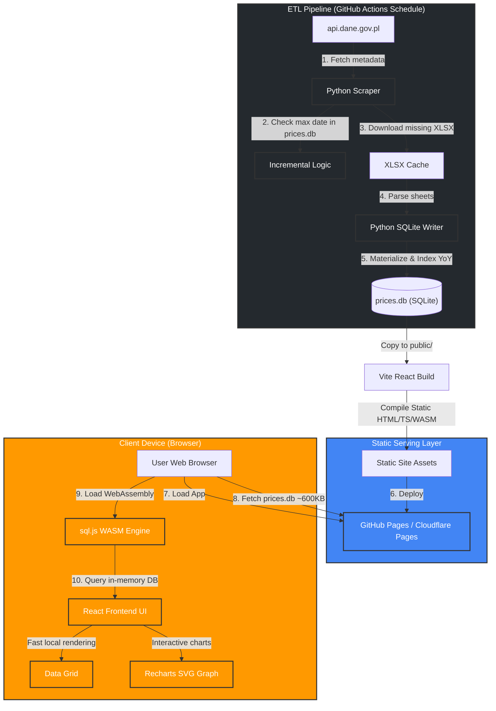

# Crops Prices Tracking App: New Architecture Design

This document describes the new architecture of the crops prices tracking application, transitioning from a decoupled GCP-based stack (BigQuery, Cloud Functions, GCS, Cloud Run, DuckDB via HTTPFS) to a **zero-cost, client-side serverless (Jamstack) architecture**.

---

## 1. Overview

The application follows a static client-side database pattern. Data processing runs in a scheduled CI/CD pipeline, and database queries execute directly in the user's browser using WebAssembly.

---

## 2. Technology Stack

### Frontend & Client-side Execution
*   **Vite + React (TypeScript):** Modern, type-safe single-page application framework. TypeScript provides static type-safety for our database rows, lookup mappings, filters, and chart datasets.
*   **Tailwind CSS (v3):** Utility-first CSS framework for clean, responsive, and maintainable styling.
*   **Recharts:** An interactive, SVG-based charting library designed natively for React.
*   **sql.js / SQLite-Wasm:** A WebAssembly port of SQLite. The frontend fetches the database file once, loads it into memory, and performs fast local SQL queries.
*   **Recommended JS/TS Package Manager: `pnpm`**
    *   *Why pnpm?* It is significantly faster and more disk-space efficient than standard `npm`. It achieves this by hard-linking packages from a single global content-addressable store on your machine rather than copying duplicate node modules.
    *   *Setup:* Since NVM is installed, you can enable `pnpm` globally by running `npm install -g pnpm`. If you prefer to avoid installing new tools, standard `npm` works perfectly fine.

### ETL & Data Hydration
*   **Python 3.12:** Scrapes, downloads, and processes market bulletins.
*   **uv:** A modern, extremely fast Python package installer and resolver (replacing Poetry).
*   **Python Virtual Environment:** Managed locally in a `.venv` directory in the repository root. This ensures separation from system Python and allows fast, local dependencies management.
*   **openpyxl & pandas:** Used to parse raw Excel formats and clean price records.
*   **sqlite3:** Standard Python library to assemble and index the SQLite database file.
*   **GitHub Actions:** Executes the ETL pipeline on a scheduled cron job (e.g., daily), compiles the new database, builds the Vite production app, and deploys it to static hosting.

### Hosting
*   **Static Pages (GitHub Pages or Cloudflare Pages):** 100% free, fast global CDN, and immune to server-side security vulnerabilities.

---

## 3. Database Schema (Normalized Star Schema)

To minimize file size for initial download and ensure fast client-side joins, the database uses a normalized star schema. We pre-compute and materialize year-over-year (YoY) statistics in a separate table during the Python ETL step to avoid executing slow window-function joins in WebAssembly.

### Table Definitions

#### 1. Lookup Tables
*   `products`: `id` (INTEGER PRIMARY KEY), `name` (TEXT), `type` (TEXT: `'vegetables'` or `'fruits'`)
*   `units`: `id` (INTEGER PRIMARY KEY), `name` (TEXT)
*   `places`: `id` (INTEGER PRIMARY KEY), `name` (TEXT)
*   `origins`: `id` (INTEGER PRIMARY KEY), `name` (TEXT: `'KRAJOWE'` or `'IMPORTOWANE'`)

#### 2. Fact Table (`prices`)
Stores raw bulletin records.
*   `id` (INTEGER PRIMARY KEY AUTOINCREMENT)
*   `product_id` (INTEGER FK -> `products.id`)
*   `unit_id` (INTEGER FK -> `units.id`)
*   `place_id` (INTEGER FK -> `places.id`)
*   `origin_id` (INTEGER FK -> `origins.id`)
*   `price_min` (REAL)
*   `price_max` (REAL)
*   `date` (TEXT: `'YYYY-MM-DD'`)

#### 3. Materialized YoY Table (`prices_yoy`)
Pre-computed year-over-year pricing data to optimize client performance.
*   `product_id` (INTEGER FK -> `products.id`)
*   `unit_id` (INTEGER FK -> `units.id`)
*   `place_id` (INTEGER FK -> `places.id`)
*   `origin_id` (INTEGER FK -> `origins.id`)
*   `date` (TEXT: `'YYYY-MM-DD'`)
*   `price_min` (REAL)
*   `price_max` (REAL)
*   `year_ago_min` (REAL)
*   `year_ago_max` (REAL)

### Database Indexing
Indexes will be created on the following columns to optimize client-side filters and joins:
*   `idx_prices_date`: `prices(date)`
*   `idx_prices_filters`: `prices(place_id, origin_id, date)`
*   `idx_prices_yoy_lookup`: `prices_yoy(place_id, origin_id, date)`
*   `idx_prices_yoy_history`: `prices_yoy(product_id, place_id, origin_id, date)`

---

## 4. Workflows & Environments

### Python venv & dependency migration
We are moving away from Poetry. The python environment is initialized locally using `uv` with standard package management:
1.  **Venv Initialization:** Create the local environment with `uv venv .venv`.
2.  **Dependencies List:** All required packages are listed in a standard root `requirements.txt` (including `requests`, `pydantic`, `pandas`, `openpyxl`, `pyyaml`, and `tqdm`). Legacy dependencies like `nicegui` and `matplotlib` are excluded.
3.  **Installation:** Dependencies are installed using `uv pip install -r requirements.txt`.

### Development Workflow
Local development runs completely offline with no cloud server dependencies:
1.  **Frontend Server:** Run `pnpm dev` (or `npm run dev`) in the `frontend/` directory.
2.  **Database File:** Vite serves `frontend/public/prices.db` locally.
3.  **Local Data Hydration:** To test scraping or catch up on data locally, run the Python build script. It outputs directly to `frontend/public/prices.db`.

### Production Pipeline (GitHub Actions)
The production environment operates entirely serverless:
1.  **Trigger:** A scheduled cron trigger executes the GitHub Actions workflow.
2.  **Incremental Scrape:**
    *   Clones the repository containing the existing `frontend/public/prices.db`.
    *   Reads the latest date in the database.
    *   Queries `api.dane.gov.pl` for resources modified after that date.
    *   Downloads only the new `.xlsx` files.
    *   Parses new records and updates the SQLite database.
3.  **Build:** Runs `pnpm build` (or `npm run build`) to compile React-TS assets and copies the updated database.
4.  **Deploy & Commit:**
    *   Pushes the built output to the hosting branch (e.g. `gh-pages`).
    *   Commits the updated `prices.db` back to the main branch.

---

## 5. Migration Roadmap

The refactoring will be executed in four distinct phases:

### Phase 1: Legacy Purge & Python Environment Setup
*   **Purge Legacy GCP Files:** Clean up files no longer needed immediately:
    *   `Dockerfile` (GCP Cloud Run container config)
    *   `cloudbuild.yaml`, `cloudbuild.staging.yaml`, `cloudbuild.prod.yaml`
    *   `deploy.sh`
    *   `functions/` directory (Cloud Functions)
*   **Python Setup:** Set up the new Python environment using `uv venv .venv` and install the clean dependencies from `requirements.txt` (excluding GCP services and Poetry files).

### Phase 2: Database Refactor & Scraper Update
*   Write `scripts/build_sqlite_db.py` to create the normalized schema and process raw Excel files.
*   Implement logic to query the Polish API and download the past ~1.5 years of missing bulletins.
*   Populate `prices.db` locally and verify its size (target: under 700 KB).

### Phase 3: React TypeScript Frontend Initialization
*   Initialize Vite + React (TypeScript) project in `/frontend` using `pnpm` (or `npm`).
*   Configure Tailwind CSS v3.
*   Set up `sql.js` WASM configuration to fetch and initialize the database in a React Context using type-safe definitions.

### Phase 4: UI Implementation & CI/CD Setup
*   Recreate the dashboard components in TypeScript (Responsive filter drawer, prices table grid, and Recharts interactive graphs).
*   Bind React states to clean SQL queries executed against the WASM database instance.
*   Author `.github/workflows/etl_and_deploy.yml` for incremental updates and builds.
*   **Final legacy clean up:** Delete the `app/` folder (NiceGUI Python app) and `poetry.lock` / `pyproject.toml` once the UI is verified.
