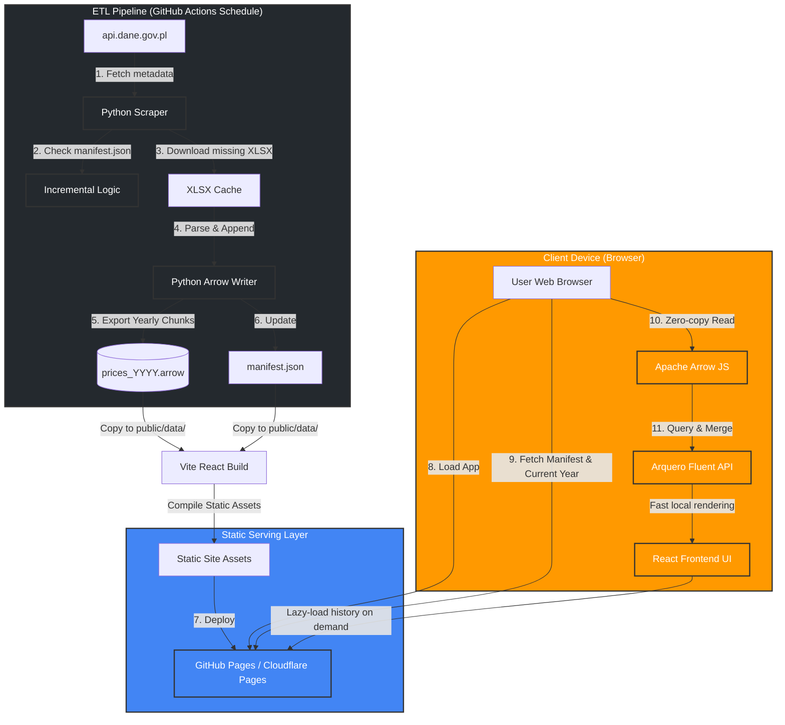

# Crops Prices Tracking App: New Architecture Design

This document describes the new architecture of the crops prices tracking application, transitioning from a decoupled GCP-based stack (BigQuery, Cloud Functions, GCS, Cloud Run, DuckDB via HTTPFS) to a **zero-cost, client-side serverless (Jamstack) architecture**.

---

## 1. Overview

The application follows a **Partitioned Columnar Store** pattern. Data is processed in a scheduled CI/CD pipeline and served as immutable Apache Arrow chunks. The frontend fetches only the necessary data (e.g., the current year) for the initial render, lazy-loading historical chunks as needed.

---

## 2. Technology Stack

### Frontend & Client-side Execution
*   **Vite + React (TypeScript):** Modern, type-safe single-page application framework.
*   **Tailwind CSS (v3):** Utility-first CSS framework for clean, responsive styling.
*   **Recharts:** Interactive, SVG-based charting library.
*   **Apache Arrow (JS):** Reads IPC files (Feather V2) directly from binary buffers.
*   **Arquero (only if necessary):** A "dplyr-like" library for high-performance data manipulation. It handles the merging of yearly Arrow chunks and filtering for the UI.
*   **IndexedDB (optional):** Used to cache historical `.arrow` files locally for near-instant subsequent loads.

### ETL & Data Hydration
*   **Python 3.12:** Scrapes and processes market bulletins.
*   **uv:** Fast Python package installer.
*   **Pandas & PyArrow:** Handles data cleaning and exports dictionary-encoded Arrow IPC files.
*   **GitHub Actions:** Executes the ETL pipeline on a scheduled cron job.

### Hosting
*   **Static Pages (GitHub Pages or Cloudflare Pages):** 100% free, fast global CDN.

---

## 3. Data Strategy (Partitioned Columnar)

To maximize performance and minimize initial download size, data is split into manageable chunks.

### File Structure (`public/data/`)
*   **`manifest.json`**: Contains metadata, available years, and the last update timestamp.
*   **`lookups.arrow`**: Common dictionary-encoded strings (product names, units, places) to ensure consistency across chunks.
*   **`prices_2024.arrow`, `prices_2023.arrow`, etc.**: Yearly data files containing the core price columns.

### Table Layout (Arrow Columns)
* `date`: Date64 (YYYY-MM-DD)

* `product_id`: UInt16 (Lookup key)

* `place_id`: UInt16 (Lookup key)

* `origin_id`: UInt8 (Lookup key: KRAJOWE/IMPORTOWANE)

* `price_min`: Float32

* `price_max`: Float32

  

---

## 4. Workflows

### First-Time Load Optimization
The app prioritizes **Time to Interactive (TTI)**:
1.  Fetch `manifest.json` (~1KB).
2.  Fetch `lookups.arrow` (~50KB) and the current year's file (e.g., `prices_2024.arrow` ~200KB).
3.  Total initial data payload: **< 300KB**.
4.  The dashboard renders immediately. Historical data is only fetched if the user expands the date range or requests a YoY comparison.

### Caching Strategy
*   **Historical Chunks:** Since past data is immutable, chunks for previous years are served with long-lived cache headers.
*   **Incremental Updates:** Only the current year's file and the manifest are updated weekly.

---

## 5. Migration Roadmap

### Phase 1 ✅ — Legacy Purge & Python Environment Setup
*   Completed: Purged GCP configs, initialized `uv` environment with `requirements.txt`.

### Phase 2: Data Refactor & Scraper Update
*   Write `scripts/build_arrow_db.py` to implement the partitioned export logic.
*   Implement incremental scraping from `api.dane.gov.pl`.
*   Generate the initial set of yearly `.arrow` chunks and `manifest.json`.

### Phase 3: React TypeScript Frontend Initialization
*   Initialize Vite + React project.
*   Implement the Arrow/Arquero data loading layer with support for lazy-loading historical chunks.

### Phase 4: UI Implementation & CI/CD Setup
*   Build the dashboard and interactive charts.
*   Author the GitHub Actions workflow for automated weekly updates.
